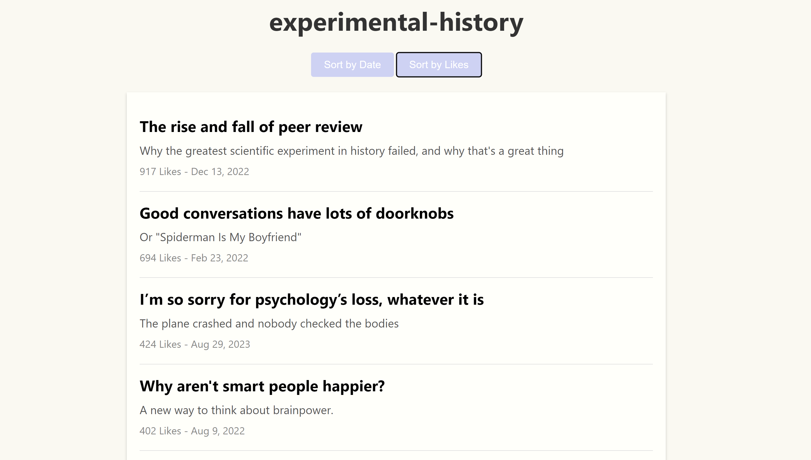

# Substack2Markdown

Substack2Markdown is a Python tool for downloading free and premium Substack posts and saving them as both Markdown and 
HTML files, and includes a simple HTML interface to browse and sort through the posts. It will save paid for content as 
long as you're subscribed to that substack. 

🆕 @Firevvork has built a web version of this tool at [Substack Reader](https://www.substacktools.com/reader) - no 
installation required! (Works for free Substacks only.)




Once you run the script, it will create a folder named after the substack in `/substack_md_files`,
and then begin to scrape the substack URL, converting the blog posts into markdown files. Once all the posts have been
saved, it will generate an HTML file in `/substack_html_pages` directory that allows you to browse the posts.

You can either hardcode the substack URL and the number of posts you'd like to save into the top of the file, or 
specify them as command line arguments.

## Features

- Converts Substack posts into Markdown files.
- Generates an HTML file to browse Markdown files.
- Supports free and premium content (with subscription).
- The HTML interface allows sorting essays by date or likes.

## Installation

Clone the repo and install the dependencies:

```bash
git clone https://github.com/yourusername/substack_scraper.git
cd substack_scraper

# # Optinally create a virtual environment
# python -m venv venv
# # Activate the virtual environment
# .\venv\Scripts\activate  # Windows
# source venv/bin/activate  # Linux

pip install -r requirements.txt
```

For the premium scraper, update the `config.py` in the root directory with your Substack email and password:

```python
EMAIL = "your-email@domain.com"
PASSWORD = "your-password"
```

You'll also need Microsoft Edge installed for the Selenium webdriver.

## Usage

Specify the Substack URL and the directory to save the posts to:

You can hardcode your desired Substack URL and the number of posts you'd like to save into the top of the file and run:
```bash
python substack_scraper.py
```

For free Substack sites:

```bash
python substack_scraper.py --url https://example.substack.com --directory /path/to/save/posts
```

For premium Substack sites:

```bash
python substack_scraper.py --url https://example.substack.com --directory /path/to/save/posts --premium
```

To scrape a specific number of posts:

```bash
python substack_scraper.py --url https://example.substack.com --directory /path/to/save/posts --number 5
```

### Online Version

For a hassle-free experience without any local setup:

1. Visit [Substack Reader](https://www.substacktools.com/reader)
2. Enter the Substack URL you want to read or export
3. Click "Go" to instantly view the content or "Export" to download Markdown files

This online version provides a user-friendly web interface for reading and exporting free Substack articles, with no installation required. However, please note that the online version currently does not support exporting premium content. For full functionality, including premium content export, please use the local script as described above.

## Viewing Markdown Files in Browser

To read the Markdown files in your browser, install the [Markdown Viewer](https://chromewebstore.google.com/detail/markdown-viewer/ckkdlimhmcjmikdlpkmbgfkaikojcbjk)
browser extension. But note, we also save the files as HTML for easy viewing, 
just set the toggle to HTML on the author homepage. 

Or you can use our [Substack Reader](https://www.substacktools.com/reader) online tool, which allows you to read and export free Substack articles directly in your browser. (Note: Premium content export is currently only available in the local script version)
