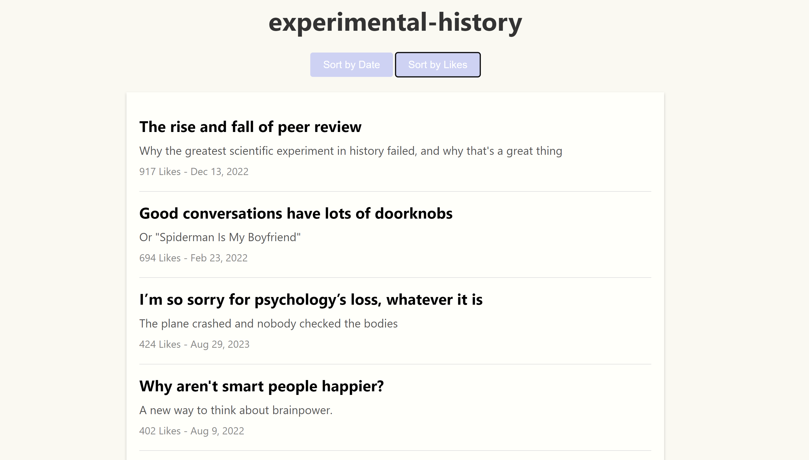
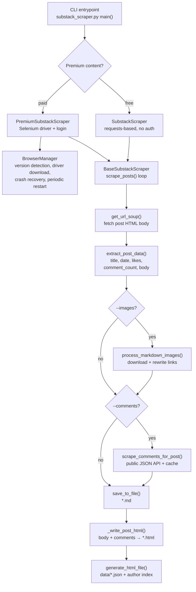
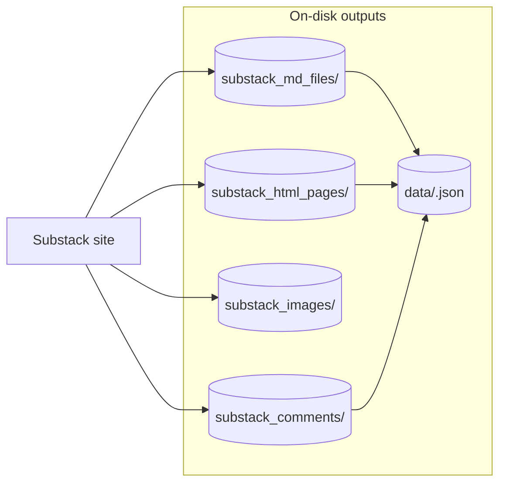
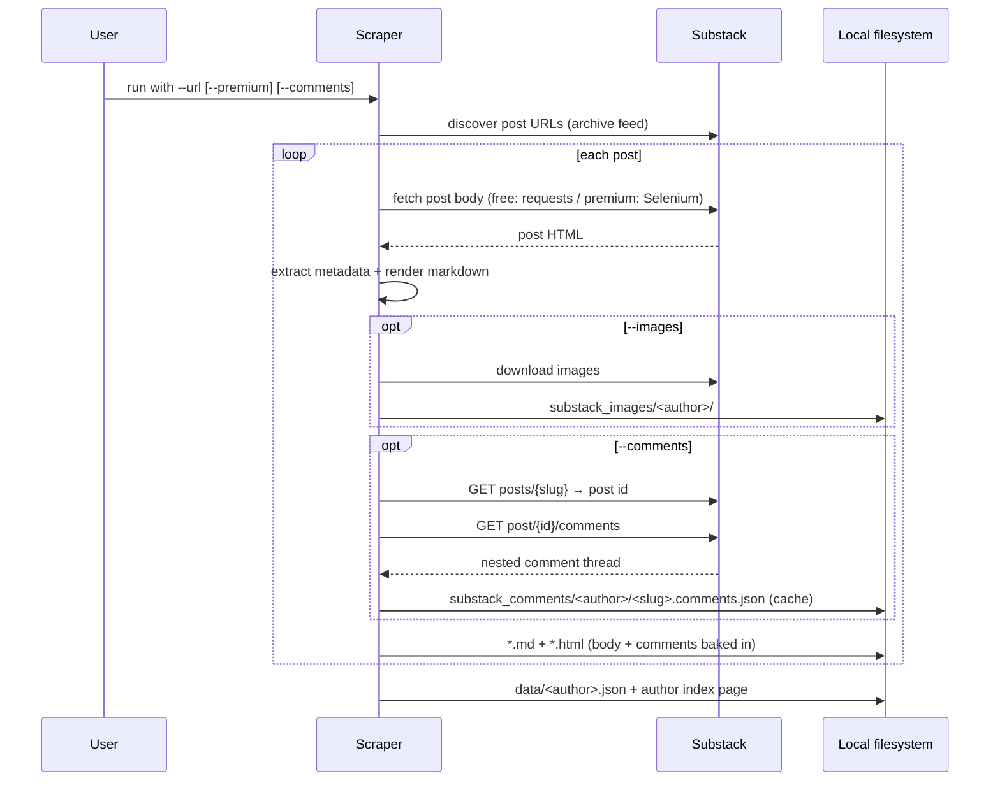
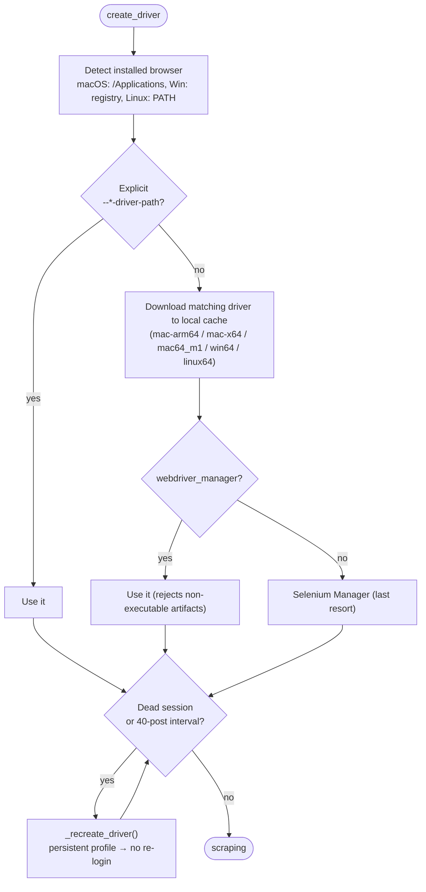

# Substack2Markdown

Substack2Markdown is a Python tool for downloading free and premium Substack posts and saving them as both Markdown and
HTML files, and includes a simple HTML interface to browse and sort through the posts. It will save paid for content as
long as you're subscribed to that substack.

🆕 @Firevvork has built a web version of this tool at [Substack Reader](https://www.substacktools.com/reader) - no
installation required! (Works for free Substacks only.)




Once you run the script, it will create a folder named after the substack in `/substack_md_files`,
and then begin to scrape the substack URL, converting the blog posts into markdown files. Once all the posts have been
saved, it will generate an HTML file in `/substack_html_pages` directory that allows you to browse the posts.

You can either hardcode the substack URL and the number of posts you'd like to save into the top of the file, or
specify them as command line arguments.

## Features

- Converts Substack posts into Markdown files.
- Generates an HTML file to browse Markdown files.
- Supports free and premium content (with subscription).
- Supports scraping a single post URL directly (for example, `/p/my-post`).
- Can download Substack-hosted images locally with `--images`.
- Can fetch each post's comment thread with `--comments` (public threads free; paid-only threads with `--premium`),
  rendered into the per-post HTML page and surfaced as a sortable "Comments" column in the index.
- The HTML interface allows sorting essays by date, likes, or comments.
- Cross-platform browser/driver support, including **macOS (Intel & Apple Silicon)** with automatic
  `chromedriver`/`edgedriver` download and crash recovery.
- Optional MDX frontmatter output for static-site generators.
- **Substack-styled HTML rendering** — per-post pages match the classic Substack look (Spectral
  serif, orange links, centered title/subtitle/byline header). Re-render existing posts with
  `render_posts.py` without re-scraping (see [Substack-style Rendering](#substack-style-rendering)).

## System Architecture


```mermaid
flowchart TD
    CLI["CLI entrypoint<br/>substack_scraper.py main()"]
    Scraper{Premium content?}
    Free["SubstackScraper<br/>requests-based, no auth"]
    Premium["PremiumSubstackScraper<br/>Selenium driver + login"]
    BM["BrowserManager<br/>version detection, driver download,<br/>crash recovery, periodic restart"]
    Core["BaseSubstackScraper<br/>scrape_posts() loop"]

    FetchBody["get_url_soup()<br/>fetch post HTML body"]
    Extract["extract_post_data()<br/>title, date, likes,<br/>comment_count, body"]
    ImgOpt{--images?}
    ImgProc["process_markdown_images()<br/>download + rewrite links"]
    CmtOpt{--comments?}
    CmtFetch["scrape_comments_for_post()<br/>public JSON API + cache"]

    SaveMD["save_to_file()<br/>*.md"]
    Render["_write_post_html()<br/>body + comments → *.html"]
    Index["generate_html_file()<br/>data/*.json + author index"]

    CLI --> Scraper
    Scraper -->|free| Free
    Scraper -->|paid| Premium
    Premium --> BM
    Free --> Core
    Premium --> Core
    Core --> FetchBody
    FetchBody --> Extract
    Extract --> ImgOpt
    ImgOpt -->|yes| ImgProc --> CmtOpt
    ImgOpt -->|no| CmtOpt
    CmtOpt -->|yes| CmtFetch --> SaveMD
    CmtOpt -->|no| SaveMD
    SaveMD --> Render
    Render --> Index
```


```mermaid
flowchart LR
    substack["Substack site"]
    subgraph Local["On-disk outputs"]
        MD[("substack_md_files/<author>")]
        HTML[("substack_html_pages/<author>")]
        IMG[("substack_images/<author>")]
        CMT[("substack_comments/<author>")]
        DATA[("data/<author>.json")]
    end
    substack --> MD
    substack --> HTML
    substack --> IMG
    substack --> CMT
    MD & HTML & CMT --> DATA
```

## Installation

Clone the repo and install the dependencies:

```bash
git clone https://github.com/yourusername/substack_scraper.git
cd substack_scraper

# # Optionally create a virtual environment
# python -m venv venv
# # Activate the virtual environment
# .\venv\Scripts\activate  # Windows
# source venv/bin/activate  # Linux

pip install -r requirements.txt
```

For the premium scraper, update the `config.py` in the root directory with your Substack email and password:

```python
EMAIL = "your-email@domain.com"
PASSWORD = "your-password"
```

For premium scraping you need a Chromium-based browser installed. **Chrome** is the default (recommended); **Microsoft
Edge** is also supported. On macOS the scraper auto-detects Chrome/Edge under `/Applications`, including Apple Silicon
(`mac-arm64`) vs Intel (`mac-x64`) builds, and downloads the matching driver.

## Usage

Specify the Substack URL and the directory to save the posts to:

You can hardcode your desired Substack URL and the number of posts you'd like to save into the top of the file and run:
```bash
python substack_scraper.py
```

For free Substack sites:

```bash
python substack_scraper.py --url https://example.substack.com --directory /path/to/save/posts
```

For premium Substack sites (Chrome is recommended):

```bash
python substack_scraper.py --url https://example.substack.com --directory /path/to/save/posts --premium
```

To scrape a single post directly:

```bash
python substack_scraper.py --url https://example.substack.com/p/my-post
```

To download images locally and rewrite markdown image links:

```bash
python substack_scraper.py --url https://example.substack.com --images
```

### Comments

Fetch each post's comment thread with `--comments`. Threads are cached under
`substack_comments/<author>/<slug>.comments.json` (so re-runs are cheap and make no extra network calls), rendered into
the individual post's HTML page, and counted in the sortable index.

- **Public threads** need no authentication — works with the free scraper.
- **Paid-only threads** require `--premium` (the logged-in browser's cookies authenticate the comment API).

```bash
# Public comment threads (free scraper)
python substack_scraper.py --url https://example.substack.com --comments

# Paid-only comment threads
python substack_scraper.py --url https://example.substack.com --premium --comments

# Newest first instead of Substack's "best" ordering
python substack_scraper.py --url https://example.substack.com --comments --comments-sort most_recent_first
```

To scrape a specific number of posts:

```bash
python substack_scraper.py --url https://example.substack.com --directory /path/to/save/posts --number 5
```

To emit YAML frontmatter (title/subtitle/date/author/image) suitable for MDX sites
instead of the default `# title` / `**Likes:** N` header:

```bash
python substack_scraper.py --url https://example.substack.com --frontmatter mdx
```

### Workflow


```mermaid
sequenceDiagram
    participant User
    participant Scraper
    participant Substack
    participant FS as Local filesystem

    User->>Scraper: run with --url [--premium] [--comments]
    Scraper->>Substack: discover post URLs (archive feed)
    loop each post
        Scraper->>Substack: fetch post body (free: requests / premium: Selenium)
        Substack-->>Scraper: post HTML
        Scraper->>Scraper: extract metadata + render markdown
        opt --images
            Scraper->>Substack: download images
            Scraper->>FS: substack_images/<author>/
        end
        opt --comments
            Scraper->>Substack: GET posts/{slug} → post id
            Scraper->>Substack: GET post/{id}/comments
            Substack-->>Scraper: nested comment thread
            Scraper->>FS: substack_comments/<author>/<slug>.comments.json (cache)
        end
        Scraper->>FS: *.md + *.html (body + comments baked in)
    end
    Scraper->>FS: data/<author>.json + author index page
```

## CLI Reference

| Flag | Default | Description |
| --- | --- | --- |
| `-u, --url` | — | Base URL of the Substack site (or a single `/p/<post>` URL). |
| `--render-only` | off | Skip scraping; re-render existing Markdown into Substack-styled HTML (no network). |
| `--render-all` | off | With `--render-only`, re-render every author under `data/`. |
| `-d, --directory` | `substack_md_files` | Directory for scraped Markdown files. |
| `--html-directory` | `substack_html_pages` | Directory for scraped HTML files. |
| `-n, --number` | `0` (all) | Number of posts to scrape. |
| `--images` | off | Download Substack-hosted images and rewrite markdown links. |
| `--comments` | off | Fetch each post's comment thread (public free; paid-only needs `--premium`). |
| `--comments-sort` | `best` | Comment order: `best` or `most_recent_first`. |
| `--frontmatter` | `legacy` | `legacy` (`# title` / `**Likes:** N`) or `mdx` (YAML frontmatter). |
| `-p, --premium` | off | Use browser automation for premium/paid content. |
| `--browser` | `chrome` | `chrome` or `edge` for premium scraping. |
| `--headless` | off | Run the browser headless (may trigger CAPTCHA). |
| `--persistent-profile` | off | Reuse a browser profile to persist login across runs. |
| `--skip-login` | off | Skip login (use with `--persistent-profile` after first login). |
| `--chrome-driver-path` | — | Manual `chromedriver` path (troubleshooting). |
| `--edge-driver-path` | — | Manual `msedgedriver` path (troubleshooting). |
| `--chrome-path` | — | Manual Chrome executable path. |
| `--edge-path` | — | Manual Edge executable path. |
| `--user-agent` | — | Custom User-Agent string. |

## Browser & Driver Support

The `BrowserManager` resolves a working WebDriver through a layered fallback:


```mermaid
flowchart TD
    Start([create_driver]) --> Detect["Detect installed browser<br/>macOS: /Applications, Win: registry, Linux: PATH"]
    Detect --> S1{"Explicit<br/>--*-driver-path?"}
    S1 -->|yes| Use1["Use it"]
    S1 -->|no| S2["Download matching driver to local cache<br/>(mac-arm64 / mac-x64 / mac64_m1 / win64 / linux64)"]
    S2 --> S3{"webdriver_manager?"}
    S3 -->|yes| Use2["Use it (rejects non-executable artifacts)"]
    S3 -->|no| S4["Selenium Manager (last resort)"]
    Use1 & Use2 & S4 --> Probe{"Dead session<br/>or 40-post interval?"}
    Probe -->|yes| Recreate["_recreate_driver()<br/>persistent profile → no re-login"]
    Recreate --> Probe
    Probe -->|no| Done([scraping])
```

Notable resilience features:

- **macOS driver detection** — locates Chrome/Edge under `/Applications` (and `~/Applications`) and picks the correct
  platform build for Apple Silicon vs Intel.
- **Crash recovery** — on `InvalidSessionIdException`, `tab crashed`, `chrome not reachable`, etc., the driver is
  recreated and the same URL is retried. With a persistent profile this requires no re-login.
- **Periodic restart** — every 40 posts the driver is restarted to shed accumulated state/leaks.

## Backfilling Comment Counts

Posts scraped before comment support was added have no `comment_count` and render as "0 Comments" in the index.
`backfill_comment_counts.py` resolves each post's count from Substack's public posts API, writes it back into
`data/<author>.json`, and regenerates the author's HTML index. Posts that already have a count are skipped by default.

```bash
# Backfill one or more authors (defaults to https://<author>.substack.com/)
python backfill_comment_counts.py aischoollibrarian
python backfill_comment_counts.py news --base-url https://aakashgupta.substack.com/

# Re-fetch even posts that already have a count
python backfill_comment_counts.py aischoollibrarian --force
```

## Substack-style Rendering

Per-post HTML pages are rendered to match the **classic default Substack article look**: a
Spectral serif body (19px / 1.6 line-height), left-aligned text, orange (`#ff6719`) links on a
white background, a ~728px single column, and a centered header block (cover image → title →
subtitle → author · date byline). Title/subtitle/date are pulled out of the body into a
structured header, so they're arranged like a real Substack post rather than inlined as markdown.

The rendered HTML is decoupled from scraping, so you can re-apply the theme to already-scraped
posts at any time **without re-scraping or any network calls**. Metadata comes from the on-disk
Markdown (legacy or MDX frontmatter) plus `data/<author>.json`; cached comment threads (from
`--comments`) are baked in when present.

```bash
# Re-render one or more authors from existing Markdown + data JSON
python render_posts.py aischoollibrarian
python render_posts.py aischoollibrarian news

# Re-render every author found under data/
python render_posts.py --all
```

The same is available as a flag on the main CLI:

```bash
python substack_scraper.py --render-only aischoollibrarian
python substack_scraper.py --render-only --render-all
```

Newly scraped posts automatically use the Substack-styled renderer. The Markdown/MDX source
files are unchanged — only the HTML output is restyled.

## Output Layout

```
substack_md_files/<author>/      # scraped posts (.md)
substack_html_pages/<author>/    # scraped posts (.html, body + optional comments)
substack_images/<author>/        # downloaded images (--images)
substack_comments/<author>/      # cached comment threads (--comments)
data/<author>.json               # index data (title, date, likes, comment_count, links)
```

## Online Version

For a hassle-free experience without any local setup:

1. Visit [Substack Reader](https://www.substacktools.com/reader)
2. Enter the Substack URL you want to read or export
3. Click "Go" to instantly view the content or "Export" to download Markdown files

This online version provides a user-friendly web interface for reading and exporting free Substack articles, with no installation required. However, please note that the online version currently does not support exporting premium content. For full functionality, including premium content export, please use the local script as described above. Built by @Firevvork.

## Viewing Markdown Files in Browser

To read the Markdown files in your browser, install the [Markdown Viewer](https://chromewebstore.google.com/detail/markdown-viewer/ckkdlimhmcjmikdlpkmbgfkaikojcbjk)
browser extension. But note, we also save the files as HTML for easy viewing,
just set the toggle to HTML on the author homepage.

Or you can use our [Substack Reader](https://www.substacktools.com/reader) online tool, which allows you to read and export free Substack articles directly in your browser. (Note: Premium content export is currently only available in the local script version)
